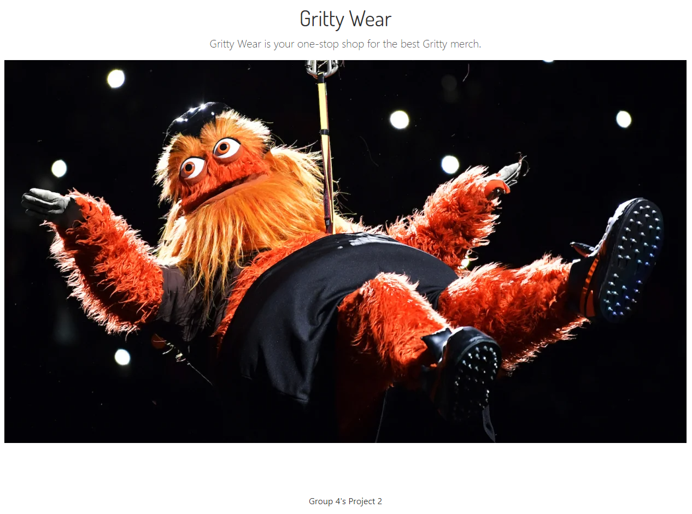

<<<<<<< HEAD
# Project-2-Repo
A base layout repo until we figure out what our plan is for project 2

## Description

## Tech Used

## Contributors
* 
* 
* 
* 

## License
MIT License
=======
# Gritty Wear
For the best Gritty merch!🎆

## Site Preview

## Description
Come shop at Gritty Wear for the best Gritty gear. Checkout is completed securely via Stripe. For a chance to win a discount code, play rock-paper-scissors against Gritty!

## Tech Used
* [Node.js](https://nodejs.org/en/)
* [Express.js](https://expressjs.com/)
* [Handlebars.js](https://handlebarsjs.com/)
* [MySQL](https://www.mysql.com/)
* [Sequelize](https://www.npmjs.com/package/sequelize)
* [Stripe API](https://stripe.com/docs/api)
* [express-session](https://www.npmjs.com/package/express-session)
* [cookies](https://www.npmjs.com/package/express-session)
* [dotenv](https://www.npmjs.com/package/dotenv)
* [Bootstrap](https://getbootstrap.com)
* [Heroku](https://www.heroku.com/)

## Contributors
* [Susan Lee](https://github.com/s-s-lee)
* [Rahsan Lewis](https://github.com/RahsanLewis)
* [Anne Panagotopulos](https://github.com/Aepango)
* [Rick Welte](https://github.com/rktvpr)

## License
[MIT License](https://github.com/rktvpr/Gritty-Wear/blob/main/LICENSE)
>>>>>>> 61d38fc7789f94f68cc76212ddf2d7d2f53f4857
